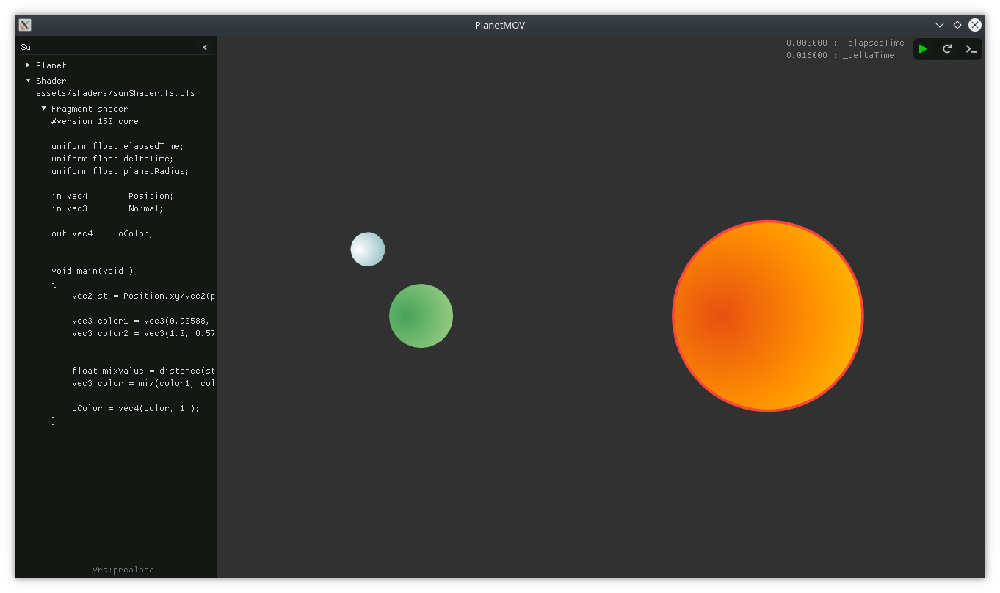

# PlanetMOV

* * *

Main purpose of PlanetMOV project is getting know how to work with Cinder library(Render process and function set), Lua binder, shader languages and program architecture.

Currently supports only Linux




## Futures

* * *

- [x] Linux build system
- [x] Planets config file
- [ ] Glsl shaders
    - [x] Fragment shaders
    - [ ] Vertex shades
- [ ] Hlsl shaders
- [ ] SPIRV shaders
- [ ] Lua scripting
    - [ ] PlanetMOV Lua headers(classes and functions set) 
    - [ ] VM binding(binding scripts to plants)
    - [ ] Events(OnStart, OnUpdate, OnRender)


More information can be found on [PlanetMOV Trello](https://trello.com/b/55gNFNto)


## Dependencies

* * *

This project uses:
- [cinder/Cinder](https://github.com/cinder/Cinder.git)
- [flingengine/Catch2](https://github.com/flingengine/Catch2.git)
- [open-source-parsers/jsoncpp](https://github.com/open-source-parsers/jsoncpp.git)


## Building

* * *

Clone the project & submodules:

```
git clone https://github.com/DeinsOne/PlanetMOV.git
cd PlanetMov
git submodule update --init
```

## Linux

Install all the libraries that are needed:

```
# Ubuntu
sudo apt install libsdl2-dev libsfml-dev libglew-dev libglm-dev libgtk-3-dev

# Fedora
sudo dnf install SFML-devel glm-devel glew-devel SDL2-devel gtk3-devel
```

### Build

```
./build.sh

# Or manually
cmake .
make
```

__Note:__ You can use building flags to specify building behavior. All flags detecting manually by default 

```
./build.sh -buildtype="Release/Debug" -gltarget="ogl/es2"
```